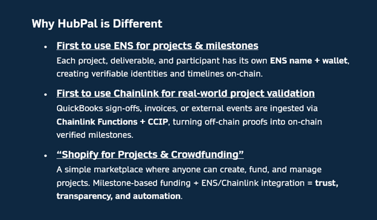
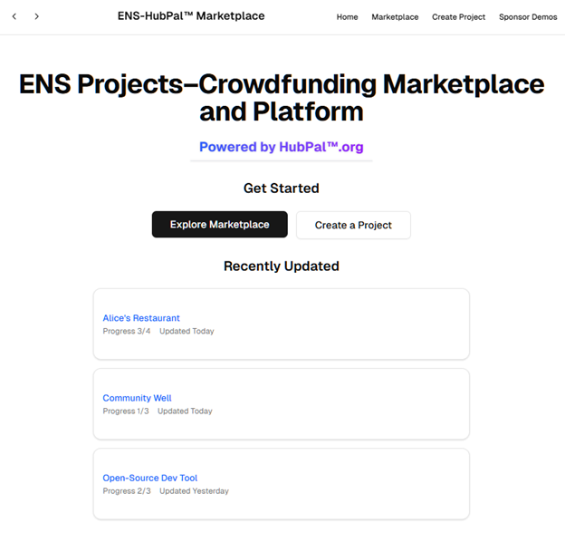
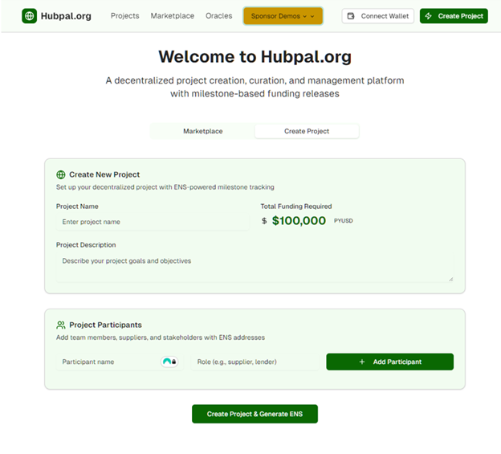
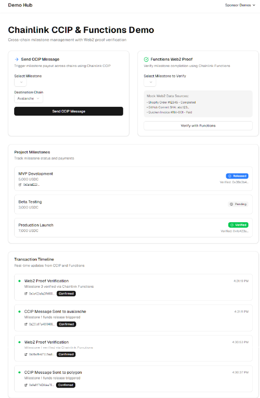
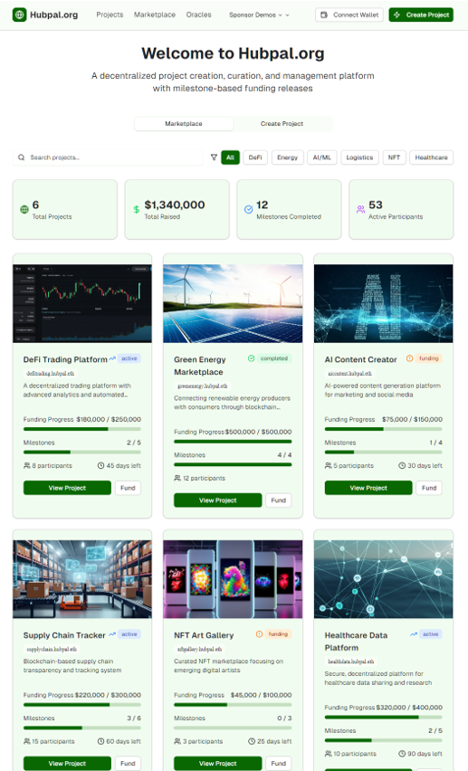
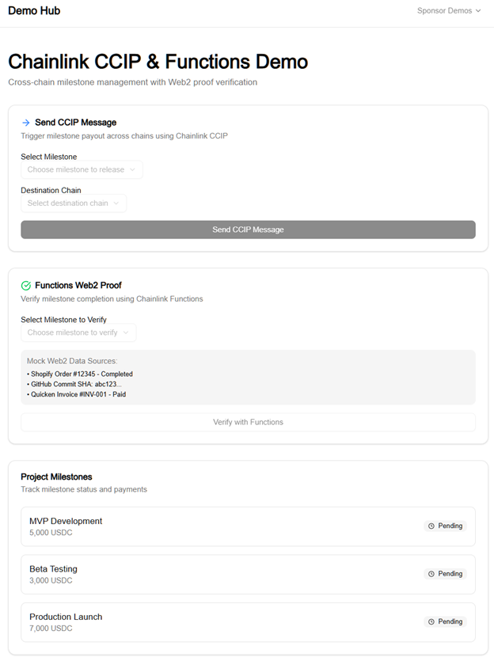
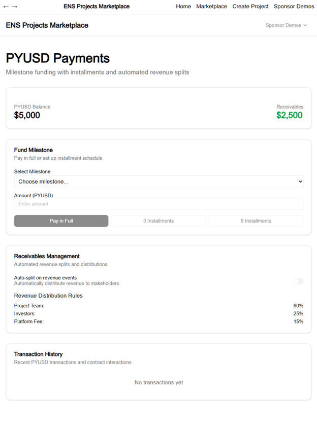
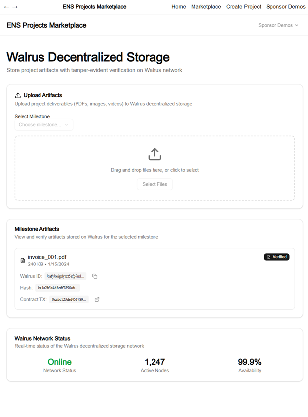

  

# HubPal_v2 — ENS + Chainlink + PYUSD “Shopify for Projects & Crowdfunding”

[Live Demo on Vercel](https://vercel.com/halfhashds-projects/v0-hub-pal-2)  
[GitHub Repository](https://github.com/HalfHashd/hubpal_v2)  

---

## 🌍 Overview
**HubPal** is a decentralized **project creation, crowdfunding, and milestone management platform**.  

- **ENS**: Each project and milestone gets its own ENS subdomain.  
- **Chainlink**: Validates deliverables using QuickBooks / real-world data feeds.  
- **PYUSD (PayPal stablecoin)**: Enables staking + milestone payments, with installment/credit-style models.  
- **Walrus (Sui storage)**: Decentralized storage for critical data and proofs.  

Think of HubPal as a **“Shopify for projects & crowdfunding”** — where every deliverable, milestone, and fund release is tracked transparently.

---

## ✨ Key Features
- **ENS Integration**  
  Projects auto-mint ENS subdomains for milestones, suppliers, lenders, auditors.  
- **Chainlink Data Feeds**  
  QuickBooks/Shopify events trigger milestone completions + fund releases.  
- **Project Marketplace**  
  OpenSea-style tiles showing active projects, milestones, progress, and funding.  
- **Payments**  
  PYUSD for staking & milestone payouts. Installment/“Pay Over Time” models for services.  
- **Stretch Goals**  
  Oracles and CCIP endpoints with their own ENS identities + staking mechanisms.  

---

## 🛠️ Tech Stack
- **Language**: TypeScript (auto-generated via [v0.app](https://v0.app) AI builder).  
- **Frameworks**: React + Next.js (via v0.app / Vercel).  
- **Blockchain**: Ethereum (ENS + Chainlink CCIP).  
- **Storage**: Walrus (Sui).  
- **Payments**: PayPal PYUSD.  
- **Infra/Deploy**: GitHub + Vercel.  

---

## 🔗 Protocol Usage

**ENS**  
- First application of ENS to crowdfunding & project milestones.  
- Every project → ENS name; every milestone/supplier/lender → ENS subdomain.  
- ENS names resolve across marketplace & project timelines.

**Chainlink**  
- First demonstration of QuickBooks → Chainlink CCIP → ENS project milestone flow.  
- Invoices/revenue events in QuickBooks trigger smart contract releases to suppliers/lenders.  

**PayPal (PYUSD)**  
- Milestone payouts funded in PYUSD.  
- Modeled PayPal “Pay Over Time” as a layaway/credit-style option for projects & services.  

---

## 🏗️ How It’s Made
- The concept was developed with **ChatGPT** over several months.  
- For the hackathon, we pivoted 3 days before kickoff to focus on **ENS + Chainlink** integration.  
- Judges/tips from Chainlink team suggested using **v0.app (AI coding tool)** to accelerate build.  
- Built 100% AI-assisted:  
  - ChatGPT wrote the **prompts**  
  - v0.app generated the **code + UI**  
  - Synced to **GitHub + Vercel** automatically  
- Two builds:  
  1. First prototype (7h) — scrapped after merging issues.  
  2. Final build (8–10h) — clean restart, stable + demo-ready.  
- This is my **first GitHub code repo** (previous experience was only uploading PDFs).  

---

## 📸 Screenshots

  
   
  
   
  

More in `/assets`.

---

## 📚 Additional Resources
Older repository with **business model notes & drafts**:  
👉 [hubpal (original repo)](https://github.com/HalfHashd/hubpal)  

---

## 🚀 Mission
> **Don’t we all want responsible projects?**  
> Make the world safe from dumps and rugs!  

---

## 🏅 Hackathon Tracks
This project directly targets the following sponsor tracks:

1. **ENS** – First integration of ENS subnames for **projects, milestones, and participants**.  
2. **Chainlink** – First demo of using Chainlink to **validate real-world project deliverables**.  
3. **PayPal PYUSD** – Milestone escrow + “Pay Over Time” simulation.  
4. **Walrus** – Demo of decentralized file storage for project data.  

---

## 🖥️ Live Demo
👉 [View Live App](https://v0.app/chat/no-content-fY03UScKZ5V)  
👉 [GitHub Repo](https://github.com/HalfHashd/hubpal_v2)  

---

## 📸 Screenshots
*(add screenshots of Home, Marketplace, Create Project, and Sponsor Demos here)*  

---

## 🛠️ How It Works
1. Create a new project from the home page.  
2. Assign milestones (e.g., Planning, Prototype, MVP, Production).  
3. Each milestone = ENS subdomain + Chainlink feed.  
4. Mark milestone complete via QuickBook-style page → Chainlink verifies → updates marketplace/project view.  
5. Payments release in PYUSD/USDC as milestones complete.  

---

## 📂 Project Structure
- `pages/index.tsx` → Home page  
- `pages/marketplace.tsx` → Project marketplace tiles  
- `pages/create.tsx` → Create Project form  
- `pages/project/[slug].tsx` → Individual project detail + timeline  
- `pages/sponsor/*` → Sponsor demo pages (ENS, Chainlink, PYUSD, Walrus, QuickBooks)  
- `lib/` → Store, types, utilities  

---

## 📌 Key Innovation
- ✅ **First use of ENS for projects & milestones**  
- ✅ **First Chainlink demo for real-world project completion**  
- ✅ **Shopify-style marketplace for crowdfunding with milestones**  

---

## 👥 Team
Project by **HubPal.org**  
Hackathon Demo 2025

---

## Additional Resources

📖 **Earlier Project Documentation:**  
For more background on the HubPal project (business model, extended description, and initial design notes), see the original README here:  
👉 [https://github.com/HalfHashd/hubpal](https://github.com/HalfHashd/hubpal)

  

<h3 align="center">Mission: Don't we all want responsible projects? Make the world safe from dumps and rugs!</h3>

  

ℹ️ This current repository (`hubpal_v2`) is the live hackathon demo build created with [v0.app](https://v0.app) and deployed on [Vercel](https://vercel.com).

  

  

  

  

  

  

  

  

  

================================= 
================================= 
Below was created by teh V0.app - I am saving it by pushing it down. (08.17.22025. 2:52 am)

# HubPal_2

*Automatically synced with your [v0.app](https://v0.app) deployments*

## Overview

This repository will stay in sync with your deployed chats on [v0.app](https://v0.app).
Any changes you make to your deployed app will be automatically pushed to this repository from [v0.app](https://v0.app).

## Deployment

Your project is live at:

**[https://vercel.com/halfhashds-projects/v0-hub-pal-2](https://vercel.com/halfhashds-projects/v0-hub-pal-2)**

## Build your app

Continue building your app on:

**[https://v0.app/chat/projects/1KPWSugTFD6](https://v0.app/chat/projects/1KPWSugTFD6)**

## How It Works

1. Create and modify your project using [v0.app](https://v0.app)
2. Deploy your chats from the v0 interface
3. Changes are automatically pushed to this repository
4. Vercel deploys the latest version from this repository
